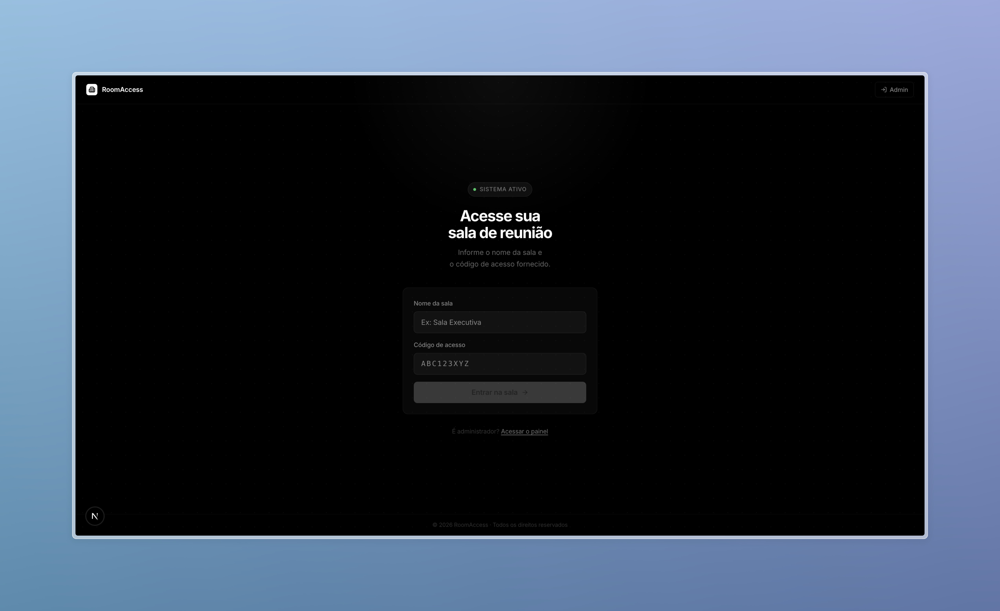

# Room Access — Backend

[](https://nestjs.com)
[](https://www.typescriptlang.org)
[](https://www.prisma.io)
[](https://www.postgresql.org)

Backend service for managing room access control — handling rooms, users and access logs with granted/denied status tracking.

> Frontend repository: [room-access-front](https://github.com/KeevenOliveira/room-access-front)



---

## Stack

| Tool | Purpose |
|---|---|
| NestJS | HTTP framework (Fastify adapter) |
| Prisma | ORM / migrations |
| TypeScript | Type safety |
| Biome | Linter + Formatter |
| Jest + SWC | Unit testing |
| Swagger | API documentation |
| class-validator | Request validation |
| Docker | Local PostgreSQL setup |

---

## Architecture

```
src/
├── core/                         # Shared Kernel (domain-agnostic)
│   ├── domain/
│   │   ├── entities/             # Entity & AggregateRoot base classes
│   │   ├── value-objects/        # ValueObject & UniqueEntityId
│   │   ├── events/               # DomainEvent base
│   │   └── errors/               # DomainError, Either (Result pattern)
│   ├── application/
│   │   ├── use-case.interface.ts # Generic UseCase contract
│   │   └── pagination.ts         # Reusable pagination helpers
│   └── infrastructure/
│       ├── database/             # PrismaService + DatabaseModule (Global)
│       └── http/filters/         # DomainExceptionFilter
│
└── modules/
    └── rooms/                    # Rooms feature module
        ├── domain/               # Room (AggregateRoot), RoomName (VO), RoomRepository (abstract)
        ├── application/          # CreateRoom, FindRoomById, ListRooms use-cases + DTOs
        └── infrastructure/       # Controller, PrismaRepository, InMemoryRepository, Mapper, Presenter
```

### Layer responsibilities

- **Domain** — pure business rules, no external dependencies. Entities, Value Objects, domain errors.
- **Application** — orchestrates use-cases. Depends only on domain interfaces.
- **Infrastructure** — concrete implementations (Prisma, HTTP controllers). Depends on the layers above.
- **Core** — shared primitives across all modules (Entity, VO, Either, etc).

---

## Patterns

- **Either / Result Pattern** — use-cases throw typed `DomainError` subclasses
- **Repository Pattern** — `RoomRepository` is an abstract class injected via DI; production uses Prisma, tests use `InMemoryRoomRepository`
- **Mapper** — isolates the conversion between Prisma model and domain entity
- **Presenter** — formats HTTP response without exposing entity internals
- **AggregateRoot** — supports domain events via `addDomainEvent()`

---

## Setup

```bash
# 1. Copy environment variables
cp .env.example .env

# 2. Install dependencies
npm install

# 3. Start the database
npm run docker:up

# 4. Run migrations
npm run prisma:migrate

# 5. (Optional) Seed initial data
npm run prisma:seed

# 6. Start in development mode
npm run start:dev
```

API available at `http://localhost:3001/api/v1`  
Swagger docs at `http://localhost:3001/api/docs`

---

## Testing

```bash
# Unit tests
npm test

# With coverage
npm run test:cov

# Watch mode
npm run test:watch
```

---

## Lint & Format

```bash
# Check and fix lint + format
npm run check

# Format only
npm run format

# Lint only
npm run lint
```

---

## Production

```bash
# Full deploy pipeline (generate, migrate, build)
npm run deploy

# Start production server
npm run start:prod
```

---

## Adding a new module

1. Create `src/modules/<name>/`
2. Implement `domain/entities/`, `domain/value-objects/`, `domain/repositories/`
3. Create use-cases under `application/use-cases/`
4. Implement the Prisma repository in `infrastructure/repositories/`
5. Create the controller in `infrastructure/controllers/`
6. Register everything in `<name>.module.ts` and import it in `AppModule`
